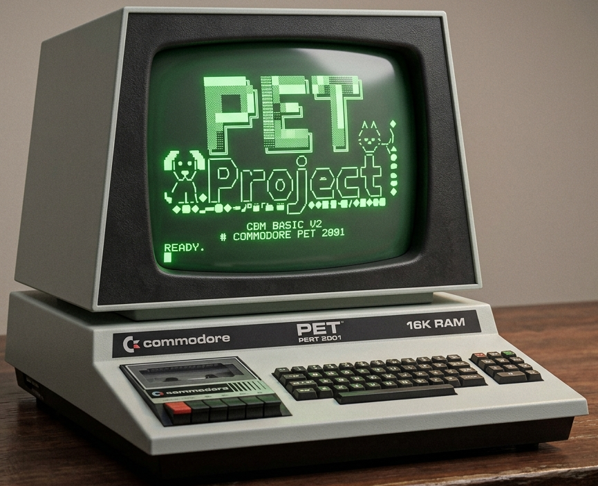

<p align="center">
  
</p>

# PET Project

[](LICENSE)


PET Project is a set of tools, skills, and an MCP to enable agentic Commodore
PET coding and debugging using the VICE emulator.

> The Python package is imported as `petlib`, installed as `pet-tools`, and
> driven by the `pet` command-line tool.

## Install

Requires **Python 3.11+**, **VICE 3.5+** (provides `xpet` and `petcat`), and
the **cc65** suite (`ca65`/`ld65`, for assembling 6502 programs). Then install
this package.

macOS (Homebrew):

    brew install vice cc65
    pip install -e .

Debian / Ubuntu:

    sudo apt install vice cc65
    pip install -e .

## Quickstart

    pip install -e .
    pet session start --model pet4032      # boot an emulated PET 4032
    pet run tests/programs/hello-basic/program.bas   # tokenize + load + RUN
    pet run tests/programs/hello-asm/program.s       # assemble + load + RUN (needs cc65)
    pet screen                             # read the screen as text
    pet basic type prog.bas --run          # type a program via the keyboard
    pet mem read '$8000' 64                # hex dump of screen RAM
    pet break add start                    # symbolic breakpoint (uses .lbl symbols)
    pet wait --break                       # block until it fires
    pet step 5 && pet reg                  # single-step, inspect (PC annotated)
    pet continue                           # resume
    pet disk create work.d64 && pet disk put work.d64 game.prg game
    pet session start --disk work.d64      # boot with the disk attached
    pet disk boot work.d64                 # or attach+run mid-session
    pet rom info                           # identify the loaded ROM set
    pet rom disasm CHROUT 16               # annotated live disassembly
    pet session stop

    pet test run mytest.yaml               # declarative YAML test (format in docs/cli.md)
    pet test programs                      # run every example program as a test

Every command takes `--json` for machine-readable output — the intended
interface for AI agents.

## Supported machines

Every session boots a specific PET (`--model`, default `pet4032`). Pick by
what you want to target — and tell your AI agent things like *"make it fit
on a 4K PET"* or *"use the pet8032's 80-column screen"*:

| Model | RAM | Free at boot | BASIC | Screen | Notes |
|-------|-----|--------------|-------|--------|-------|
| `pet2001-4k` | 4 KB | 3071 bytes | 1.0 | 40×25 | The entry-level 1977 config (PET 2001-4) — the tightest target. |
| `pet2001` | 8 KB | 7167 bytes | 1.0 | 40×25 | The 8 KB original (2001-8). Different zero page (jiffy clock at $0200), no disk commands in BASIC. |
| `pet3032` | 32 KB | 31743 bytes | 2.0 | 40×25 | The BASIC most 6502 books target. |
| `pet4032` | 32 KB | 31743 bytes | 4.0 | 40×25 | **The default.** Disk commands in BASIC (`DLOAD` etc.); what the demos use. |
| `pet8032` | 32 KB | 31743 bytes | 4.0 | 80×25 | The 80-column business machine. Screen math changes: a row is 80 bytes. |
| `pet8296` | 128 KB | 31743 bytes | 4.0 | 80×25 | Banked RAM — BASIC still sees 32 KB; the rest needs bank switching. |

The screen is memory-mapped at `$8000` on every model; "free at boot" is
what BASIC reports, and is the budget a BASIC program (or a `SYS`-stub
assembly program) actually has to fit in.

## Using with AI coding agents

This toolset is built to be driven by an AI agent. Debugging state persists
across commands: when the agent halts the machine at a breakpoint, it stays
halted while the agent inspects memory, registers, and screen in separate tool
calls. There are two ways an agent can use it — pick either or both:

- **The CLI** — every `pet` command takes `--json`. Works with *any* agent
  that can run shell commands; nothing to configure.
- **The MCP server** — `pet-tools-mcp` exposes the same operations as MCP
  tools over stdio. CLI and MCP share the same sessions, so they are
  interchangeable.

Either way, the agent should read
[`skills/pet-development/SKILL.md`](skills/pet-development/SKILL.md) (the PET
workflows and pitfalls) before starting — the per-agent steps below make that
happen automatically.

The MCP config used by several agents below is this one block:

```json
{
  "mcpServers": {
    "pet-tools": { "command": "pet-tools-mcp" }
  }
}
```

Setup was verified against each agent's docs in **July 2026**; if something
has moved, check the agent's current MCP documentation.

### Any agent with a shell (simplest — works everywhere)

1. Install (see above) — that's the whole setup.
2. Start your task prompt with: *"Read docs/cli.md and
   skills/pet-development/SKILL.md, then …"*

### Claude Code

1. From the repo root, install the skills so Claude discovers them
   automatically:

   ```
   mkdir -p .claude/skills && cp -R skills/* .claude/skills/
   ```

2. (Optional) Add the MCP server: `claude mcp add pet-tools -- pet-tools-mcp`
3. Ask for what you want — e.g. paste a prompt from [`demos/`](demos/).

No `CLAUDE.md` edits are needed: installed skills load on demand, and the MCP
tools describe themselves.

### OpenAI Codex

1. Add the MCP server: `codex mcp add pet-tools -- pet-tools-mcp`
   (or add `[mcp_servers.pet_tools]` with `command = "pet-tools-mcp"` to
   `~/.codex/config.toml`).
2. Codex has no skills mechanism, so tell it where the docs are: add one line
   to the repo's `AGENTS.md` — *"For Commodore PET work, first read
   skills/pet-development/SKILL.md and docs/cli.md."*
3. Paste a prompt from [`demos/`](demos/).

### Cursor

1. Create `.cursor/mcp.json` in the repo (or `~/.cursor/mcp.json` globally)
   containing the JSON block above.
2. Create a rule (`.cursor/rules/pet.mdc`) — or a plain `AGENTS.md` — with the
   same one-liner: *"For Commodore PET work, first read
   skills/pet-development/SKILL.md and docs/cli.md."*
3. Paste a prompt from [`demos/`](demos/).

### Gemini CLI

1. Add the JSON block above to `.gemini/settings.json` in the repo (or
   `~/.gemini/settings.json` globally).
2. Add the same read-the-skill one-liner to `GEMINI.md`.
3. Paste a prompt from [`demos/`](demos/).

### Google Antigravity

1. Open the MCP store → **Manage MCP Servers** → **View raw config** and add
   the JSON block above (the file is `~/.gemini/config/mcp_config.json`).
2. Add the read-the-skill one-liner to `AGENTS.md`.
3. Paste a prompt from [`demos/`](demos/).

## Demos — try it with your AI agent

[`demos/`](demos/) is a set of ready-to-paste prompts, graded from a first
BASIC program through a machine-level debug hunt and a full arcade Snake in
6502 assembly (title screen, levels, high score) up to the flagship: an
arcade-faithful Invaders with sound, waves, and a packaged disk image
at the end. To use one:

1. Set up your agent (one section up — or use any shell agent with no setup).
2. Open a demo file and copy its prompt.
3. Paste it into your agent and watch it write, run, and debug real PET
   software on the emulated machine.

The reference example programs (with expected screen output, runnable as
regression tests via `pet test programs`) live in
[`tests/programs/`](tests/programs/).

## Sharing what you built

`pet package` turns a source file into something any VICE user can run — no
pet-tools needed on their end:

    pet package snake.s -o snake.d64 --title SNAKE

That assembles the program and writes it as the first file on a fresh disk
image, so it autostarts. The recipient just needs VICE installed:

    xpet -model 4032 snake.d64    # boots the tested PET model, runs SNAKE

(`pet package` prints this exact command; the `-model` flag matters because
stock xpet boots its own default model, and ROM behavior differs between
BASIC generations — a game reading held keys from $97 goes silently deaf on
the wrong one.) The bare `.prg` (also produced) works too, as does VICE's
File → Smart attach. Disk images travel better: they carry a real CBM
directory, so `LOAD"SNAKE",8` then `RUN` works the old-fashioned way.
Neither artifact contains ROMs or anything from this toolset.

## Status

Stable — current release **v1.1.0**. Full history: [CHANGELOG.md](CHANGELOG.md).

## AI Disclosure

PET Project is developed primarily by AI — Anthropic's Claude, working
through Claude Code — under human direction: a human sets the goals,
reviews the designs and plans, and approves the work; the AI writes the
specs, plans, code, tests, and documentation. Every change is verified by
the automated test suite, including integration tests that run against a
real VICE emulator, before it lands. The project also exists *for* AI use —
these tools are built so AI agents can write and debug Commodore PET
software — making it a working example of AI-built developer tooling.

## License

MIT license. Note that VICE is a separate GPLv2+ program invoked as a
subprocess; it is not bundled and must be installed separately.

ROM tooling reads ROM bytes from your running emulator and ships only
original label annotations — no Commodore-copyrighted code lives in this repo.
