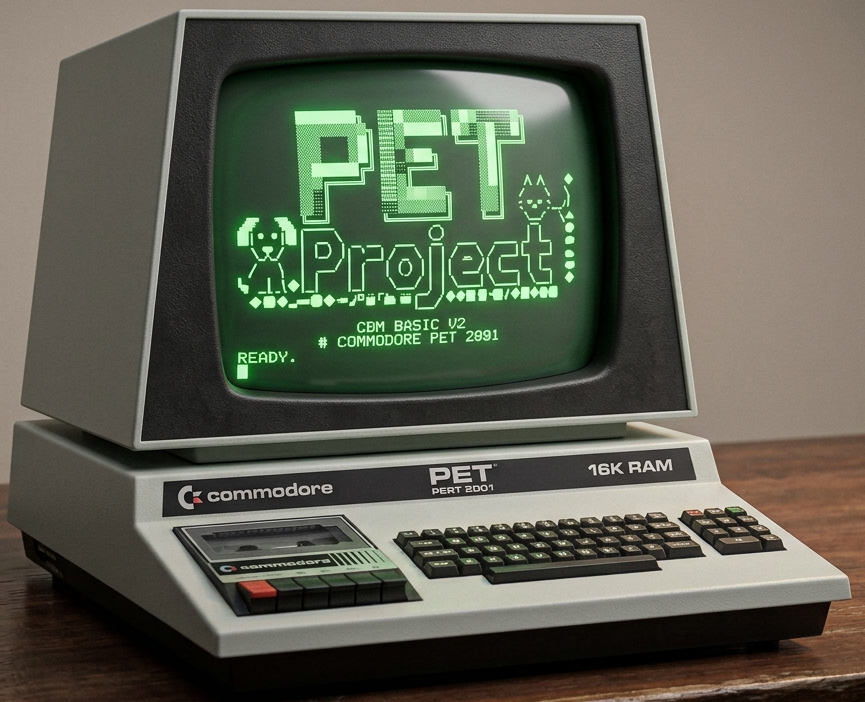
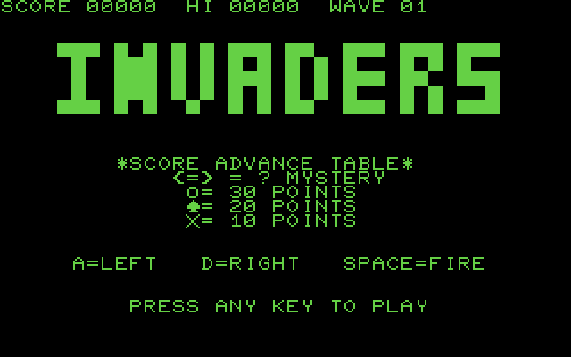
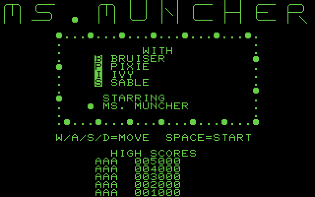

  

# PET Project

PET Project is a set of tools, skills, and an MCP to enable agentic Commodore
PET coding and debugging using the VICE emulator.

> The Python package is imported as `petlib`, installed as `pet-tools`, and
> driven by the `pet` command-line tool.

## Install

Requires **Python 3.11+**, **VICE 3.5+** (provides `xpet` and `petcat`), and
the **cc65** suite (`ca65`/`ld65`, for assembling 6502 programs).

pet-tools is not on PyPI, so it installs from a checkout. Every
`pip install -e .` below runs from that directory:

    git clone https://github.com/nschneir/PET-Project.git
    cd PET-Project

### macOS (Homebrew)

    brew install vice cc65
    pip install -e .

Homebrew's VICE bundles the Commodore ROM images, so that is the whole setup.
If `pip` answers `error: externally-managed-environment`, Homebrew's Python is
marked externally managed (PEP 668) like Debian's — use the venv route from
step 4 below.

### Debian / Ubuntu

Three things differ from macOS: the package lives outside `main`, the packaged
VICE ships **no ROMs**, and the system Python refuses `pip install`. Step 1 is
Debian-only.

**1. Debian only — enable the `contrib` component.** `vice` lives there, and
stock installs leave `contrib` off, so `apt` reports "Unable to locate package
vice". Ubuntu carries `vice` in `multiverse`, on by default — skip to step 2.

| Debian | Enable `contrib` by |
| --- | --- |
| 13+ (deb822 format) | adding `contrib` to the `Components:` line of `/etc/apt/sources.list.d/debian.sources` |
| 12 and older | running `sudo add-apt-repository contrib` (from `software-properties-common`), or adding `contrib` to each `deb` line in `/etc/apt/sources.list` |

**2. Install VICE and cc65.**

    sudo apt update
    sudo apt install vice cc65

**3. Install the ROMs.** This step has no macOS equivalent. Debian strips the
Commodore ROM images out of the package — which is *why* it sits in `contrib`
— and Ubuntu rebuilds from the same source. Without them, `xpet` exits
immediately with `Couldn't load ROM` and no PET ever boots.

Download and unpack the upstream VICE tarball. Nothing in it is needed
afterwards, so unpack it in `/tmp` rather than in the repo:

    curl -L -o /tmp/vice.tar.gz https://sourceforge.net/projects/vice-emu/files/releases/vice-3.9.tar.gz/download
    tar xf /tmp/vice.tar.gz -C /tmp

Copy both ROM directories into place, then delete the download:

    mkdir -p ~/.local/share/vice
    cp -r /tmp/vice-3.9/data/PET /tmp/vice-3.9/data/DRIVES ~/.local/share/vice/
    rm -rf /tmp/vice.tar.gz /tmp/vice-3.9

Copy **both**: `PET` holds the machine ROMs (BASIC, kernal, editor, character
generator) and `DRIVES` holds the drive DOS ROMs the emulated 2031/4040/8050
units need — skipping it breaks every `pet disk` command and `--disk` boot.

`~/.local/share/vice` is used because it is the one search location needing no
root; VICE also checks `/usr/share/vice` and a `PET`/`DRIVES` pair beside the
`xpet` binary. Run `xpet` and look for its `VICE system file search path: …`
line to see what your build searches (`xpet -directory <path>` overrides it).

**4. Install pet-tools in a virtualenv.** Debian 12+ and Ubuntu 23.04+ mark the
system Python as externally managed (PEP 668), so installing into it is
refused:

    sudo apt install python3-venv
    python3 -m venv .venv
    .venv/bin/pip install -e .
    . .venv/bin/activate        # puts `pet` and `pet-tools-mcp` on PATH

Activate before use: the MCP configs in
[docs/agent-setup.md](docs/agent-setup.md) expect `pet-tools-mcp` to resolve
from `PATH`. (`pipx install -e .` is a fine alternative.)

**Mind the Python floor.** Ubuntu 22.04 LTS ships Python 3.10, under this
project's 3.11 requirement, and a venv built from it is refused too — install a
newer interpreter and its matching `-venv` package (`apt install python3.11
python3.11-venv` where available, otherwise deadsnakes or pyenv), then build
the venv with that. Debian 12 (3.11), Debian 13 (3.13), and Ubuntu 24.04 (3.12)
are fine as they ship.

#### Headless on Linux

`--headless` works by setting `SDL_VIDEODRIVER=dummy`, which only the SDL
builds of VICE honour. Debian and Ubuntu package the GTK3
build, which ignores those variables: on a desktop it still opens a window, and
on a display-less machine (CI, SSH, a container) it cannot start at all. Wrap
the command in `xvfb-run` there:

    sudo apt install xvfb
    xvfb-run -a pet session start --model pet4032 --headless

The same applies to `pet test run`, `pet test programs`, and the MCP server,
which all launch VICE headless.

## Quickstart

Once the Install steps above are done (on Debian/Ubuntu, from the activated
venv):

    pet session start --model pet4032      # boot an emulated PET 4032
    pet run tests/programs/hello-basic/program.bas   # tokenize + load + RUN
    pet run tests/programs/hello-asm/program.s       # assemble + load + RUN (needs cc65)
    pet screen                             # read the screen as text
    pet basic type prog.bas --run          # type a program via the keyboard
    pet mem read '$8000' 64                # hex dump of screen RAM
    pet break add start                    # symbolic breakpoint (uses .lbl symbols)
    pet wait --break                       # block until it fires
    pet step 5 && pet reg                  # single-step, inspect (PC annotated)
    pet continue                           # resume
    pet disk create work.d64 && pet disk put work.d64 game.prg game
    pet session start --disk work.d64      # boot with the disk attached
    pet disk boot work.d64                 # or attach+run mid-session
    pet rom info                           # identify the loaded ROM set
    pet rom disasm CHROUT 16               # annotated live disassembly
    pet session stop

    pet test run mytest.yaml               # declarative YAML test (format in docs/cli.md)
    pet test programs                      # run every example program as a test

Every command takes `--json` for machine-readable output — the intended
interface for AI agents.

## Supported machines

Every session boots a specific PET (`--model`, default `pet4032`). Pick by
what you want to target — and tell your AI agent things like *"make it fit
on a 4K PET"* or *"use the pet8032's 80-column screen"*:

| Model | RAM | Free at boot | BASIC | Screen | Notes |
|-------|-----|--------------|-------|--------|-------|
| `pet2001-4k` | 4 KB | 3071 bytes | 1.0 | 40×25 | The entry-level 1977 config (PET 2001-4) — the tightest target. |
| `pet2001` | 8 KB | 7167 bytes | 1.0 | 40×25 | The 8 KB original (2001-8). Different zero page (jiffy clock at $0200), no disk commands in BASIC. |
| `pet3032` | 32 KB | 31743 bytes | 2.0 | 40×25 | The BASIC most 6502 books target. |
| `pet4032` | 32 KB | 31743 bytes | 4.0 | 40×25 | **The default.** Disk commands in BASIC (`DLOAD` etc.); what the demos use. |
| `pet8032` | 32 KB | 31743 bytes | 4.0 | 80×25 | The 80-column business machine. Screen math changes: a row is 80 bytes. |
| `pet8296` | 128 KB | 31743 bytes | 4.0 | 80×25 | Banked RAM — BASIC still sees 32 KB; the rest needs bank switching. |

The screen is memory-mapped at `$8000` on every model; "free at boot" is
what BASIC reports, and is the budget a BASIC program (or a `SYS`-stub
assembly program) actually has to fit in.

## Using with AI coding agents

<!-- Keep this intro in sync with docs/agent-setup.md -->

This toolset is built to be driven by an AI agent. Debugging state persists
across commands: when the agent halts the machine at a breakpoint, it stays
halted while the agent inspects memory, registers, and screen in separate tool
calls. There are two ways an agent can use it — pick either or both:

- **The CLI** — every `pet` command takes `--json`. Works with *any* agent
  that can run shell commands; nothing to configure.
- **The MCP server** — `pet-tools-mcp` exposes the same operations as MCP
  tools over stdio. CLI and MCP share the same sessions, so they are
  interchangeable.

See **[docs/agent-setup.md](docs/agent-setup.md)** for the two integration
routes and step-by-step setup for Claude Code, OpenAI Codex, Cursor, Gemini
CLI, and Google Antigravity — all instructions work on macOS and Linux (see
[Install](#install) for the extra Debian/Ubuntu steps).

## Demos — try it with your AI agent

[`demos/`](demos/) is a set of ready-to-paste prompts, graded from a first
BASIC program through a machine-level debug hunt and a full arcade Snake in
6502 assembly (title screen, levels, high score) up to the flagships: an
arcade-faithful Invaders with sound, waves, and a packaged disk image, and
Ms. Muncher — a four-maze arcade chase with cutscenes and a self-playing
demo mode ([`demos/muncher/`](demos/muncher/)). To use one:

1. [Set up your agent](docs/agent-setup.md) — or use any shell agent, which
   needs no setup at all.
2. Open a demo file and copy its prompt.
3. Paste it into your agent and watch it write, run, and debug real PET
   software on the emulated machine.

### Play in the browser

The two flagship demos are playable right now — no install — at
**[nschneir.github.io/PET-Project/play.html](https://nschneir.github.io/PET-Project/play.html)**.
The page boots an emulated PET (ROM 4.0, 40 columns) in your browser and runs
the same `.prg` files checked into this repo.

 

The reference example programs (with expected screen output, runnable as
regression tests via `pet test programs`) live in
[`tests/programs/`](tests/programs/).

## Sharing what you built

`pet package` turns a source file into something any VICE user can run — no
pet-tools needed on their end:

    pet package snake.s -o snake.d64 --title SNAKE

That assembles the program and writes it as the first file on a fresh disk
image, so it autostarts. The recipient just needs VICE installed:

    xpet -model 4032 snake.d64    # boots the tested PET model, runs SNAKE

(`pet package` prints this exact command; the `-model` flag matters because
stock xpet boots its own default model, and ROM behavior differs between
BASIC generations — a game reading held keys from $97 goes silently deaf on
the wrong one.) The bare `.prg` (also produced) works too, as does VICE's
File → Smart attach. Disk images travel better: they carry a real CBM
directory, so `LOAD"SNAKE",8` then `RUN` works the old-fashioned way.
Neither artifact contains ROMs or anything from this toolset.

## Status

Stable — current release **v1.4.0**. Full history: [CHANGELOG.md](CHANGELOG.md).

## Related projects

PET Project is one of three Commodore toolsets built the same way — AI-written,
human-directed, and pointed at real hardware behavior rather than an
approximation of it.

- **[Project64](https://nschneir.github.io/Project64/)** — tools, skills, and
  an MCP for agentic Commodore 64 coding and debugging through the VICE
  emulator, driven by a `c64` command-line tool. PET Project's sibling: same
  shape, different machine.
- **[image64](https://nschneir.github.io/image64/)** — a native macOS app and
  command-line tool that converts modern images into pictures the C64 can
  actually display. Project64's upstream neighbor: it exports the native C64
  formats plus a runnable program, so an export goes straight to
  `c64 run picture.prg`.

## AI Disclosure

PET Project is developed primarily by AI — Anthropic's Claude, working
through Claude Code — under human direction: a human sets the goals,
reviews the designs and plans, and approves the work; the AI writes the
specs, plans, code, tests, and documentation. Every change is verified by
the automated test suite, including integration tests that run against a
real VICE emulator, before it lands. The project also exists *for* AI use —
these tools are built so AI agents can write and debug Commodore PET
software — making it a working example of AI-built developer tooling.

## License

MIT license. Note that VICE is a separate GPLv2+ program invoked as a
subprocess; it is not bundled and must be installed separately.

ROM tooling reads ROM bytes from your running emulator and ships only
original label annotations — no Commodore-copyrighted code lives in this repo.
